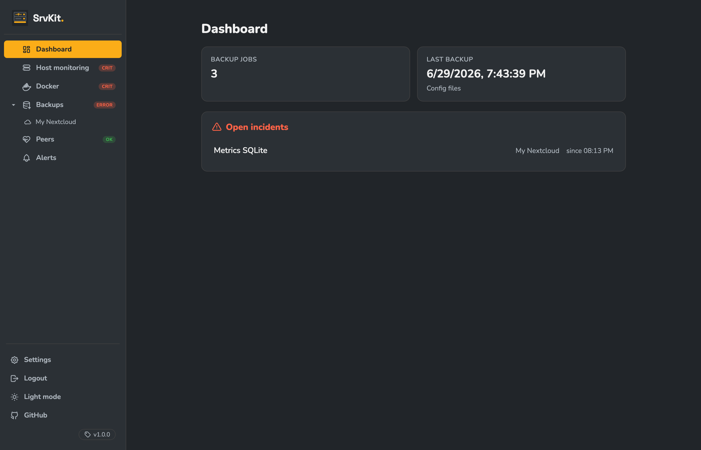
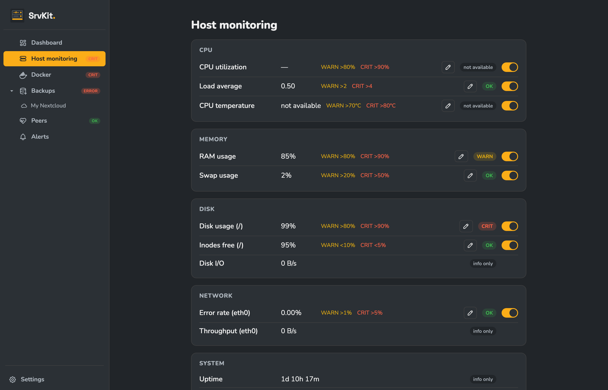
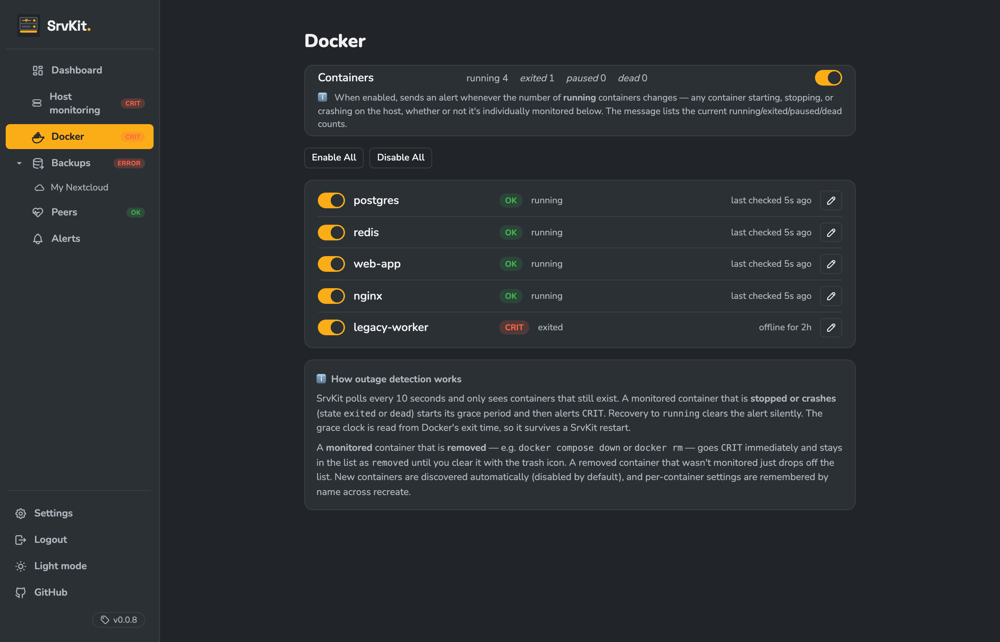
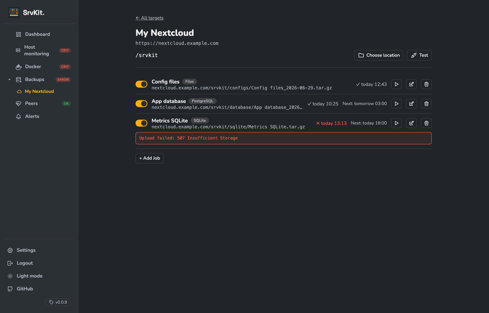
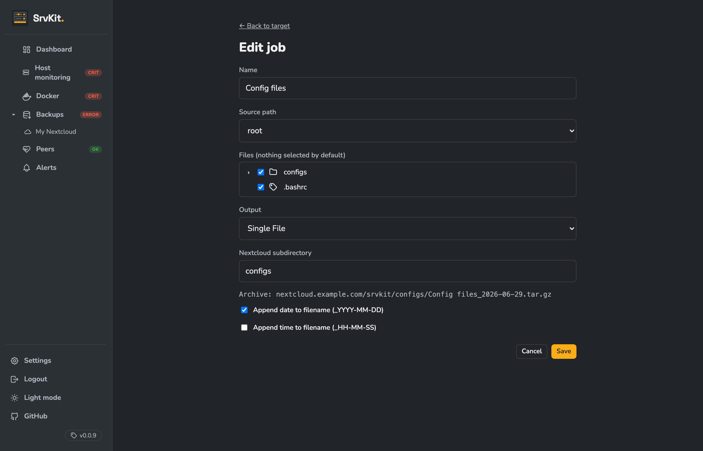
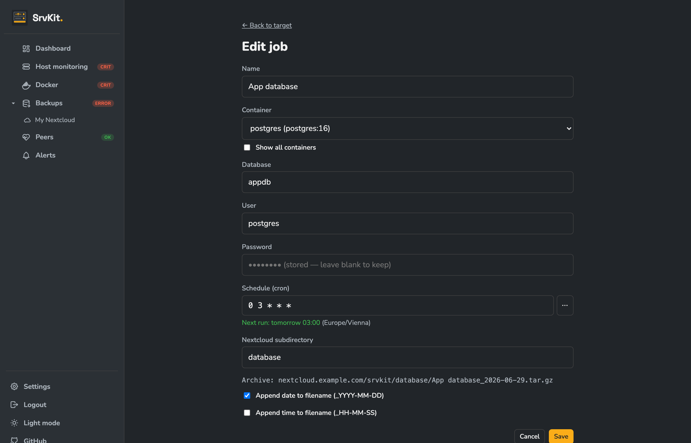

# SrvKit

Lightweight DevOps companion for self-hosted servers — host monitoring, Docker service health, and automated backups in a single container.



## Features

**Host Monitoring** — Know when your server is struggling before users do. CPU spikes, memory pressure, disk filling up, high load — SrvKit watches all of it with configurable WARN/CRIT thresholds and consecutive-poll smoothing so a brief spike doesn't wake you up at 3am.



**Docker Service Monitoring** — If a container crashes and stays down, you'll know. SrvKit tracks all your containers via the Docker socket and alerts when one stays offline beyond its grace period — long enough to survive a normal restart, short enough to catch a crash loop.



**Backups** — Mount your data directories, point SrvKit at a Nextcloud share, and your backups run automatically. Watch files for changes, back up live SQLite databases safely, or schedule `pg_dump` / `mysqldump` from running containers — all without installing anything on the host.



**Example 1 — Config files via Filewatcher**

Mount your config directories read-only and let SrvKit watch them for changes. The moment a file is modified, a `tar.gz` is uploaded to Nextcloud automatically (10s debounce). No cron required.

```yaml
volumes:
  - /etc:/backups/etc:ro
  - /root:/backups/root:ro
  - /home/deploy/.config:/backups/deploy-config:ro
```



**Example 2 — PostgreSQL via Cron**

SrvKit runs `pg_dump` directly inside your database container via the Docker socket — no `postgresql-client` needed in the image. Schedule it nightly and the dump streams straight into a compressed archive on Nextcloud.

```yaml
volumes:
  - /var/run/docker.sock:/var/run/docker.sock
```



**Alerting** — Telegram notifications land the moment something goes wrong, and again when it recovers. Each message is prefixed with your server name so you always know which machine is reporting.

## Quick start

```yaml
services:
  srvkit:
    image: inf0matics/srvkit:latest
    restart: unless-stopped
    environment:
      ENCRYPTION_KEY: "change-me-to-a-long-random-secret"
    volumes:
      - srvkit-data:/data
      - /proc:/host/proc:ro
      - /sys:/host/sys:ro
      - /etc/mtab:/host/etc/mtab:ro
      - /:/host/root:ro
      - /var/run/docker.sock:/var/run/docker.sock
      - /root:/backups/root:ro
    networks: [traefik]
    labels:
      - "traefik.enable=true"
      - "traefik.http.routers.srvkit.rule=Host(`srvkit.example.com`)"
      - "traefik.http.routers.srvkit.entrypoints=websecure"
      - "traefik.http.routers.srvkit.tls.certresolver=letsencrypt"
      - "traefik.http.services.srvkit.loadbalancer.server.port=3000"

volumes:
  srvkit-data:

networks:
  traefik:
    external: true
```

Generate an encryption key:

```bash
echo "ENCRYPTION_KEY=$(openssl rand -base64 32)"
```

Open the service URL — on first start SrvKit shows a one-time passphrase setup screen.

Full setup guide: **[docs/setup.md](docs/setup.md)**

## Volume mounts

| Mount | Purpose | Required |
|---|---|---|
| `srvkit-data:/data` | Database and state | Yes |
| `/proc:/host/proc:ro` | Host metrics (CPU, memory, load) | Host monitoring |
| `/sys:/host/sys:ro` | Host metrics (temperature, I/O) | Host monitoring |
| `/etc/mtab:/host/etc/mtab:ro` | Partition discovery | Host monitoring |
| `/:/host/root:ro` | Disk usage via statvfs | Host monitoring |
| `/var/run/docker.sock:/var/run/docker.sock` | Docker monitoring + DB backups | Docker features |
| `/your/path:/backups/name:ro` | Backup sources | File/SQLite backups |

## Development

```bash
npm install
npm run dev        # http://localhost:<auto-port>
```

Checks: `npm run lint` · `npm run typecheck` · `npm run test:unit` · `npm run test:e2e`
